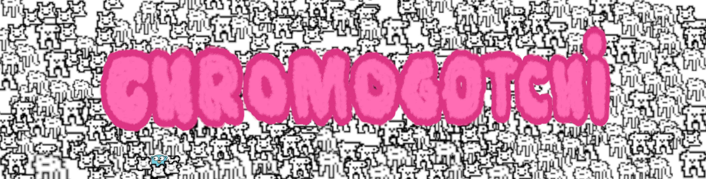

<hr/>

<p align="center">
  tamagotchi chrome extension built in Go and TypeScript 🩷
</p>

**Chromogotchi** is a virtual pet extension for Chrome. Inspired by classic Tamagotchi devices, Chromogotchi allows you to care for a virtual pet directly in your browser. Written in Go and TypeScript, it offers fun interactions and activities to keep your digital companion happy.

## Features 🛝

- **Feed and Play**: Keep your Chromogotchi happy and healthy by feeding it and playing with it.
- **Interactive UI**: Simple and intuitive interface built using TypeScript.
- **Pet Status**: Monitor your pet's happiness, hunger, and energy levels.
- **Browser Integration**: Chromogotchi lives in your Chrome browser as an extension.

## Build From Source 🧰

1. Clone the repository:
   ```bash
   git clone https://github.com/BradenEverson/chromogotchi
   cd chromogotchi
   ```

2. Install dependencies and build the extension:
    1. [TypeScript](https://www.typescriptlang.org/download/)
    3. [Go](https://go.dev/doc/install)

3. Load the extension in Chrome:
   - Open Chrome and go to `chrome://extensions/`.
   - Enable "Developer mode" at the top-right.
   - Click "Load unpacked" and select the `extension` folder in the cloned repository.

4. Running a local server:
  - Once you have the TypeScript compiled and the chrome extension loaded, you can run the Go backend by `cd`ing into the `./chromogotchi` directory and running
    ```bash
      go run .
    ```
- Upon opening the extension popup, you should see your brand new pet!

## Contributing

Feel free to open issues for bugs or feature requests. Contributions can be made via pull requests.
